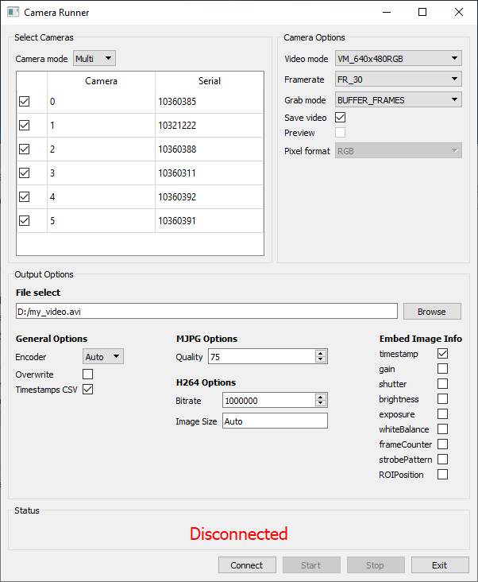
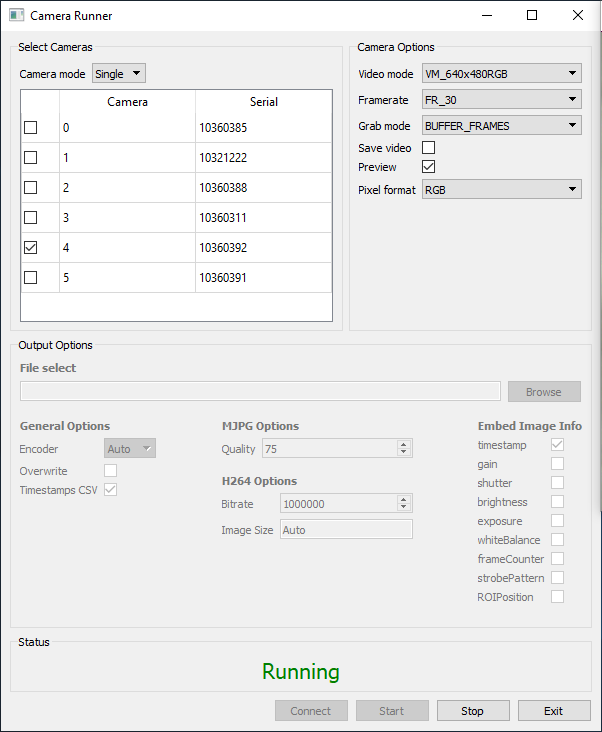
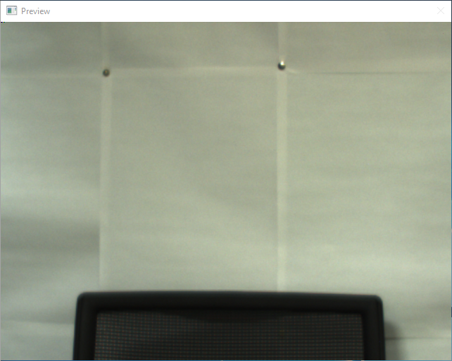
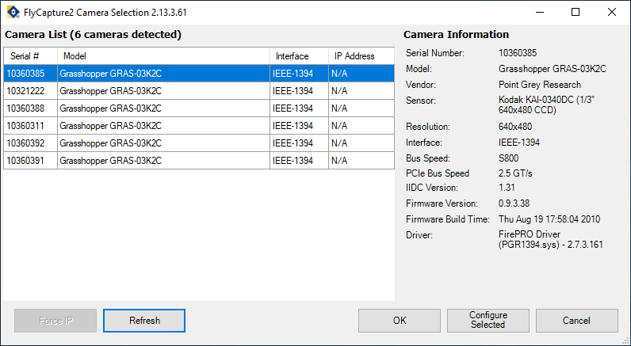
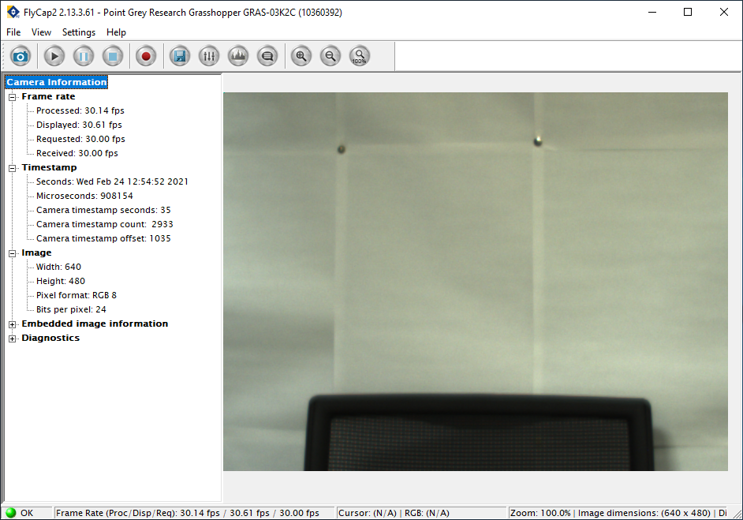
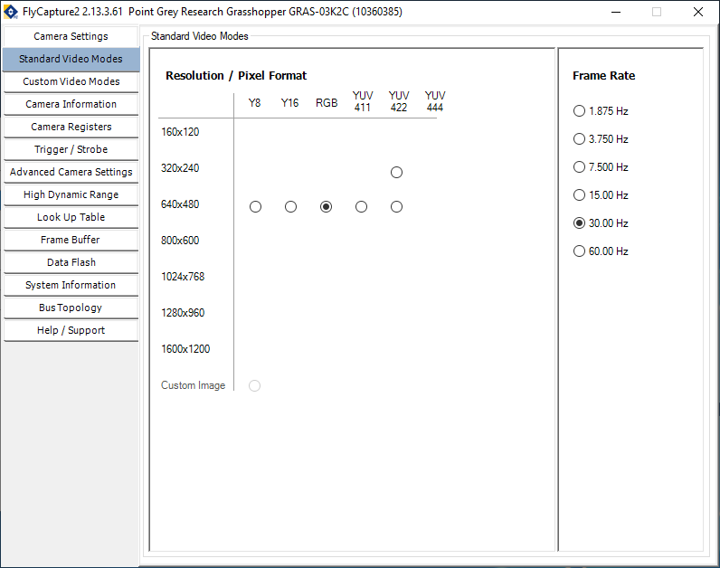

# FlyCaptureUtils

Provides tools for running simultaneous video capture from the Elephant multi-camera rig. Uses the PyCapture2 Python bindings to the FlyCapture2 SDK.

## Table of contents
- [FlyCaptureUtils](#flycaptureutils)
  - [Table of contents](#table-of-contents)
  - [Installation](#installation)
    - [Dependencies](#dependencies)
    - [Installation](#installation-1)
  - [Repository contents](#repository-contents)
    - [Compiling executables](#compiling-executables)
  - [Usage](#usage)
    - [Runner scripts](#runner-scripts)
      - [Commandline runner](#commandline-runner)
      - [GUI runner](#gui-runner)
    - [Custom usage](#custom-usage)
    - [Embedding image information](#embedding-image-information)
    - [Checking timestamps](#checking-timestamps)
    - [Tips](#tips)
  - [Why isn't the video preview supported for multi-camera operation?](#why-isnt-the-video-preview-supported-for-multi-camera-operation)


## Installation
> All necessary packages should already be installed on the Elephant computer. These instructions may be useful if any packages ever need re-installing, or if you want to run the code on a different computer.

> The code has only been tested on Windows. The PyCapture2 module is also provided for Linux, but I've no idea if the code will work on it. Mac OS is completely unsupported. The Elephant computer currently runs Windows 10.

### Dependencies
To begin with, you will need the following software installed:
- FlyCapture2 SDK
- Python 3.6 (or newer if PyCapture2 support is added in future)

The following Python packages are required for multiple scripts:
- PyCapture2
- numpy
  
In addition, further Python packages are required for specific scripts:
- The commandline runner script (**`run_camera.py`**)
  - opencv (version 3.0 or greater)
  - keyboard
- The GUI runner script (**`gui.py`**)
  - PyQt5
- **`analyse_timestamps.py`**
  - pandas
  - matplotlib
- **`extract_embedded_image_info.py`**
  - moviepy
- **`compile_executables.ps1`**
  - pyinstaller

### Installation
Most of the Python packages come pre-installed with the Anaconda distribution, or can be installed via the conda and/or pip package managers. We'll assume you're using the Anaconda distribution - the details below can be easily enough adapted for other distributions.

First, install Python 3.6 (at the time of writing, this is the most recent version supported for the PyCapture2 package, though you might install a newer version if support has since been added). If you're happy with this being the main environment you can just go ahead and install it.
```sh
conda install python=3.6
```

If you'd prefer to leave your main environment alone, then you can create a separate environment for the installation instead. Here we'll install Python 3.6 plus the anaconda metapackage, which will give us most of the packages we need.
```sh
conda create -n py36 python=3.6 anaconda
conda activate py36
```

There are just a few other packages we need to install ourselves. *opencv* and *pyinstaller* can be installed via the conda package manager.
```sh
conda install opencv pyinstaller
```

The *moviepy* and *keyboard* modules can be installed via pip.
```sh
pip install moviepy keyboard
```

The PyCapture2 isn't available in conda or pip, and must be installed manually. We'll also install the FlyCapture 2 SDK whilst we're on with it.
1. Download the products from the website: https://www.flir.co.uk/products/flycapture-sdk/. Click the download button and navigate to *FlyCapture2/Windows/*. Download the following installers:
   - FlyCapture2 SDK - *FlyCapture\<version>_x64.exe*, selecting the most recent available version.
   - PyCapture2 - *python/PyCapture2-\<version>.win-amd64-py3.6.msi*, selecting the version of PyCapture2 corresponding to the version of the FlyCapture2 SDK you selected, and ensuring the supported Python version is 3.6.
2. Install the FlyCapture2 SDK:
   1. Ensure the FlyCapture2 SDK is selected and click *Install*. The Setup wizard pops up in a new window.
   2. Accept the License Agreement
   3. Skip the release notes
   4. Leave the default registration details. Uncheck the *Automatically register with PGR via the internet* option.
   5. Select the installation location, or use the default.
   6. Do a **Complete** install
   7. Choose which type of camera connection you will be using - this determines which drivers get installed. The Elephant rig uses firewire connections. If in doubt, just install all of them.
   8. Confirm the list of drivers to be installed.
   9. You probably don't need to register the DirectShow dlls, so leave the box unchecked.
   10. Click *Install* to begin the installation.
3. Install PyCapture2:
   1. Windows might attempt to block the installer for security reasons, but it's safe to override this.
   2. Select ***Install just for me***.
   3. **DO NOT** install into the python version detected in the registry - the installer has a habit of messing up the existing python installation. Deselect the ***Python 3.6 from registry*** option (set to *Entire feature will be unavailable*), and select the ***Python from another location*** option instead (set to *Will be installed on local hard drive*). In the box at the bottom, enter the path to a convenient location (somewhere like the Desktop or Downloads folder is fine). 
   4. The installer will unpack in the location you specified above. From here, navigate to *Lib/site-packages/* and copy the *PyCapture2.cp36-win_amd64.pyd* file into the proper *Lib/site-packages/* directory of your main python installation (e.g. *C:/Users/You/Anaconda3/Lib/site-packages/* for the main environment, or *C:/Users/You/anaconda3/envs/py36/lib/site-packages/* for a separate environment).
   5. The *PyCapture2* directory in the unpacked location also has some useful contents, including documentation.


## Repository contents
- **`docs/`** : Contains this README and some documentation pdfs from PointGrey for the cameras and PyCapture2 module.
- **`analyse_timestamps.py`** : Analyses 1394 cycle timestamps from CSV (either those saved directly by the video writer, or extracted from embedded pixel data - see *extract_embedded_image_info.py*). This can be used to check the achieved frame rate, and (with multiple-camera operation) the synchrony between cameras.
- **`compile_exectuables.ps1`** : Powershell script can be used to compile GUI runner script to an executable file.
- **`extract_embedded_image_info.py`** : Extracts information embedded in pixel data of recorded videos (e.g. timestamps).
- **`FlyCaptureUtils.py`** : Contains functions and classes for interfacing with cameras. Can write your own code to use these methods, but it's easier to use the runner scripts.
- **`gui.py`** : GUI-based runner script. If *compile_executables.ps1* is run, you can also use the executable version. Convenience script for running cameras. Equivalent functionality via a commandline interface is provided by *run_camera.py*.
- **`run_camera.py`** : Commandline-based runner script. Convenience script for running cameras. Equivalent functionality via a graphical interface is provided by *<span>gui.py</span>*.

### Compiling executables
Support is provided for compling the GUI runner script (**`gui.py`**) to an executable that can be run from the file browser. The executable files themselves are quite large, so are not included with the git repository itself. Instead, the **`compile_executables.ps1`** powershell script can be run to build the executable within your local copy of the repository. The outputs will be stored in an *executables* directory created within the repository, but the executable file itself can also be accessed from the shortcut created in the top-level of the repository.


## Usage
### Runner scripts
The easiest way to operate the cameras is by the provided runner scripts. We offer 2 options: a commandline interface, and a graphical interface.

#### Commandline runner
The **`run_camera.py`** script provides a commandline-based interface. It accepts numerous commandline flags to control the camera operation.

We can use the `-h|--help` flag to print the help and usage information.
```sh
python run_camera.py -h
```

We can use `--ls` flag to check which cameras are connected. This lists the camera numbers (which we may use to select which cameras to run) and corresponding serial numbers.
```sh
python run_camera.py --ls
```
```
Cam     Serial
0       10360385
1       10321222
2       10360388
3       10360311
4       10360392
5       10360391 
```

We can run one or more cameras by using the `-c|--cam-nums` flag, following it with the numbers of the cameras we want to use. Alternatively, we can simply specify the string `all` to run all connected cameras. For a single camera, we can also display a live preview of the video feed (note this is unsupported for multi-camera operation). Let's try running a live preview from the first connected camera.
```sh
python run_camera.py -c 0 --preview
```
Once the camera has initialised, a message will be printed informing you that you can press the *Enter* key to begin. Once the camera starts running, you can press the *Esc* key to quit.

By default, the camera acquires images in RGB colour space, at a resolution of 640x480 pixels, and at 30 fps. We can use the `--video-mode` flag to change the colour mode and/or video resolution. Note that not all possible modes are supported by the camera. If we still want to run a live preview, we might also need to use the `--pixel-format` flag to change the colour conversion for the display to something appropriate for the new colour mode. Finally, the `--frame-rate` flag can be used to change the frame rate. Only some frame rates are supported, and these may change according to the video mode. See the PyCapture2 manual for a list of the possible codes for these flags (under the *Enumerated Values* section). Let's try running the camera in monochrome.
```sh
python run_camera.py -c 0 --video-mode VM_640x480Y8 --preview --pixel-format MONO8
```

More often, we'll want to save the video to an output file. We can specify a path to an output file using the `-o|--output` flag. PyCapture2 offers three encoders: AVI, MJPG, and H264. However, only the AVI encoder seems reliable, so the others are best avoided. We can set the encoder explicitly using the `--output-encoder` flag, but it's easier just to append a **.avi** extension to the output file in which case the code will automatically work out to use the AVI encoder. By default the video writer will error if the file already exists, but if you really want you can disable the error overwrite the file anyway by specifying the `--overwrite` flag.
```sh
python run_camera.py -c 0 --preview -o ./my_video.avi
```
> **WARNING:** The uncompressed AVI files are VERY large (gigabytes per minute), so make sure you have enough space to store them!

It is often useful to have timestamps for each frame. These can be used to check for dropped frames, and (if running multiple cameras) the synchrony between cameras. More details are included in the [Checking timestamps](#checking-timestamps) section. For now we'll just note that the timestamps are automatically written to a CSV file accompanying the output video AND are embedded in the video pixel data, so you don't have to do anything else to get them. If for some reason you don't want them, you can disable the CSV file with the `--no-timestamps` flag, and stop embedding the timestamps in the pixel data by specifying the `--embed-image-info` flag without any arguments.

If you're running multiple cameras, you can specify multiple camera numbers or simply the string `all` to the `-c|--cam-nums` flag. In this case you can't run the live preview anymore (and attempting to do so will raise an error), but you can still save the videos out. Here, the output file you specify serves as a basename, and the script will automatically append the camera numbers to the filenames for each camera (e.g. *my_video.avi* will become *my_video-cam0.avi*, *my_video-cam1.avi*, etc.)
```sh
python run_camera.py -c all -o ./my_video.avi
```

#### GUI runner
Alternatively, the **`gui.py`** script provides a graphical interface. If you run the **`compile_executables.ps1`** powershell script then you can also acess the GUI via the generated executable file.

The GUI contains a number of panels that can be used to configure and run the camera(s). Hovering the mouse over (most) fields will display a tooltip with further information.



- **Select Cameras** : This panel can be used to choose which camera(s) to use. It will list the camera numbers and corresponding serial numbers of all connected cameras.
  - ***Camera mode*** : Sets whether to acquire from just one (*Single*) or multiple (*Multi*) cameras.
  - The table will list the camera and serial numbers of all connected cameras. You can choose which cameras you want by (un)checking the boxes next to them. Depending on the camera mode, you'll either be able to check multiple cameras at a time (*Multi*) or only one camera at a time (*Single*).
  - By default, the runner chooses *Multi* camera operation and selects all available cameras.
- **Camera Options** : This panel can be used to change various camera and runtime settings.
  - ***Video mode*** : Sets the colour mode and video resolution. By default, we acquire in RGB colour and at 640x480 resolution. See the PyCapture2 manual for an explanation of the codes. Note that not all modes are supported by the camera.
  - ***Framerate*** : Sets the frame rate of the camera. Defaults to 30 fps. See the PyCapture2 manual for an explanation of the codes. Only some frame rates are supported, and these may change according to the video mode. 
  - ***Grab mode*** : Sets the grab mode for frame acquisition. The default (BUFFER_FRAMES) should be preferred as it reduces the risk of dropped frames. The altenative (DROP_FRAMES), as the name suggests, is prone to dropping frames.
  - ***Save video*** : Sets whether a video output will be saved, and also enables/disables the *Output Options* panel.
  - ***Preview*** : If checked, a live video preview will be displayed when running. Only accessible if the camera mode is *Single*.
  - ***Pixel format*** : Sets the format for image conversion for the live preview. Only accessible if the camera mode is *Single*. See the PyCapture2 manual for an explanation of the codes. Must be appropriate for the given video mode; the default RGB pixel format is appropriate for the default video mode.
- **Output Options** : If saving a video, this panel can be used to set the output options. This panel will be disabled if the *Save video* option is unchecked.
  > **WARNING:** The uncompressed AVI files are VERY large (gigabytes per minute), so make sure you have enough space to store them!
  - ***File select*** : Use to set the output filepath. Can either type a path in, or click the *Browse* button to use a file browser. If the camera mode is *Multi* then this will serve as the base output name, and the camera numbers will be automatically appended to each output file (e.g. *my_video.avi* will become *my_video-cam0.avi*, *my_video-cam1.avi*, etc.).
  - ***General options*** : Set general output options
    - *Encoder* : Choose the encoder. If Auto (default), it will try to automatically determine the encoder from the file extension (e.g. **.avi**). Only the AVI encoder is reliable, the others are best avoided.
    - *Overwrite* : If the file already exists, it will be overwritten if this option is checked, or an error will be raised if it is unchecked.
    - *Timestamps CSV* : If this is checked, a CSV containing frame timestamps will be saved alongside the output video file.
  - ***MJPG Options*** : Options only applicable for the MJPG encoder
    - *Quality* : Output video quality, specified as a value between 0 and 100.
  - ***H264 Options*** : Options only applicable for the H264 encdoer
    - *Bitrate* : Set in bits per second, determines video quality.
    - *Image Size* : Video resolution in pixels, specified as *(width,height)* tuple (including the brackets), or set to Auto to determine from the given video mode.
  - ***Embed Image Info*** : Types of information to embed in video pixels. The default is to embed only timestamps.
- **Status** : Displays the current status of the cameras and video acquisition. Will update as cameras are connected, and video acquisition is started and stopped.
  
The general workflow of the GUI would be as follows:
1. Set all the necessary options, as described above.
2. Click the **Connect** button to connect to the camera(s). If successful, the status will update to indicate the cameras are connected. If a live preview was enabled, an additional window will open which will be used to display the video stream.
3. Click the **Start** button to begin video acquisition. The status will update to indicate the cameras are running, and the preview will be shown if enabled.
4. When you want to stop, click the **Stop** button to stop the video acquisition and disconnect the cameras. The status will return to indicating the cameras are disconnected. The preview window will be closed if enabled.
5. When you are completely finished, click the **Exit** button to exit the application. This wil also stop the video acquisition and disconnect the cameras (if this hasn't already been done).




If the application encounters an error at any point, it will automatically stop the video acquisition and disconnect the cameras, and display the error message in a dialog box.


### Custom usage
If the runner scripts don't do what you want, you can use the functions and classes within the **`FlyCaptureUtils.py`** module to write your own custom python code.

The `Camera` class can be used to interface with one of the cameras. Pass the number of the camera you wish to connect to the `cam_num` argument; see the docstring for explanations of further arguments.
```python
cam = Camera(cam_num=0)
```

If you want to record the video to file, you can optionally open a video writer.
```python
cam.openVideoWriter('./my_video.avi')
```

To start video acquisition, call the `.startCapture` method. This must be called before attempting to extract any images.
```python
cam.startCapture()
```

You can use the `.getImage` method to read frames out of the buffer. This returns two arguments: 1) `ret` - a boolean indicating whether the frame was acquired successfully, and 2) `img` - a PyCapture2.Image object if acquisition was successful or None if it failed. If a video writer was opened, each call to this method will also write the frame out to the file. If you want to display the video feed, you can use the `img2array` function to extract the pixel data into a numy array which you can then display however you like (an OpenCV window is convenient). Here, we'll acquire 300 frames from the camera and display them.
> Not exactly sure if this is a bug or a feature of PyCapture2, but the pixel data that gets extracted is sometimes corrupted the first time you try, but seems to be okay if you extract it *twice* and only use the second result.
```python
for i in range(300):
    ret, img = cam.getImage()
    if ret:
        arr = img2array(img)
        arr = img2array(img)  # doing twice seems to prevent image corruption?
        cv2.imshow('Display', arr)
        cv2.waitKey(1)
cv2.destroyWindow('Display')
```

When you are done, call the `.close` method. This will stop the video acquisition, close any open video writers, and disconnect the camera.
```python
cam.close()
```

### Embedding image information
The video writer provides the option of embedding key bits of information (e.g. 1394 cycle timestamps) in the pixel data. This is done by writing the values into the first few pixels (top left corner) of each frame. Each value is stored as a 32-bit unsigned integer spread across groups of 4 pixels (4 x 8-bit unsigned integers). So if only one field (e.g. timestamps) is stored, the first 4 pixels will be occupied. If two fields are stored (e.g. timestamps and gain), the first 8 pixels will be occupied. There are up to 10 fields that can be stored, potentially occupying up to the first 40 pixels. This is described in more detail on pages 78-80 of the *flir-machine-vision-camera-register-reference* PDF document.
- By default, we enable embedding 1394 cycle timestamps as this is necessary to also obtain them from the metadata (see [Checking timestamps](#checking-timestamps)).
- For the embedded pixel information to be usable, the images must be monochrome (set the video mode to **VM_640x480Y8**). This is because the cameras apply Bayer colour processing to colour images, which alters the pixel values and corrupts the embedded data.

> **WARNING:** Because the first few pixels are encoding image information, they are *not* encoding the recorded scene. As a result, they must be removed prior to performing any video analysis. Strictly speaking you only need to remove the leftmost pixels as these are the only ones encoding the information, but in practice it will probably be easier to just remove the entire top row.


### Checking timestamps
It is important to check the frame timestamps to account for dropped frames and (in the case of multi-camera operation) adjust for asynchronies between the cameras. PyCapture2 allows extracting two types of timestamps (one useful, one not), and the useful type can be extracted from two different places.
1. **CPU timestamps** are available from the frame metadata. These will be included in the timestamps CSV created by the video writer (if this option is enabled). These aren't especially useful though as they only represent the time at which the frame was processed by the computer, *not* the time at which the frame was actually acquired. As such, they will only be moderately accurate.
2. **1394 cycle timestamps** give the time directly from the firewire bus, and reflect the exact moment the frame was acquired (the moment the shutter exposure ended, to be exact). They are accurate to sub-millisecond levels, and hence are much more useful. These can also be obtained from the image metadata written to the timestamps CSV file (though see caveat below), or can be embedded in the video pixel data and extracted later (but the video must be monochrome for them to be usable).

> Not sure if it's a bug or a feature of PyCapture2, but the 1394 cycle timestamps are only provided in the image metadata *if* the option to embed them in the pixel data is also enabled. This means that to use them, you must enable embedding timestamps in the pixel data regardless of whether you actually want to extract the pixel data or simply use the metadata written to the CSV file. If the embedded timestamps are not enabled, the 1394 cycle timestamps in the metadata will simply list a value of zero for all frames.

> The 1394 timestamps are provided in somewhat confusing units. They are described in more detail on page 79 of the *flir-machine-vision-camera-register-reference* PDF document. The timestamps are given in 3 columns: second count, cycle count, and cycle offset. The second count is measured in seconds cycling between 0 and 127; after 127 it loops back round to 0. The cycle count is measured in units of 1/8000th of a second (125 microsecond intervals), such that the value may lie between 0 and 7999. The cycle offset is measured in units of 1/3072nd of a cycle count (1/24,576,000th of a second, or approximately 40 nanosecond intervals), such that the value may lie between 0 and 3071. To extract the full timestamp in seconds: unwrap the second count, convert the cycle counts and offsets to seconds, and then add all of them together.

You can use the **`extract_embedded_image_info.py`** script to to extract the 1394 cycle timestamps embedded in the pixel data to a CSV file, or you can use the values from the metadata already stored in the video writer's CSV file.

The `analyse_timestamps.py` script may be used to analyse the 1394 cycle timestamps (it will accept CSV files from either the video writer or the *extract_embedded_image_info.py* script). This will produce the following outputs:
- The timestamps for each camera, converted to seconds.
- The frame durations for each camera.
- If multiple camera inputs are provided, it will calculate the synchrony between cameras for each frame, given as the difference between timestamps for each camera and the average timestamp across cameras.
- These are saved to an excel file, and it will also produce a few quick plots.

You can specify the path to the input CSV file(s) using the `-i|--input` flag, and the path to the desired output excel file using the `-o|--output` flag. Each of these flags may be specified multiple times if you wish to process a series of recordings in order. Here are some example use cases, running the script from a Windows Powershell terminal:
```powershell
# Process timestamps for a single recording from a single camera
python analyse_timestamps.py -i clip0-cam0.csv -o clip0_single.xlsx

# Process timestamps for a single recording from multiple cameras
python analyse_timestamps.py `
  -i clip0-cam0.csv clip0-cam1.csv clip0-cam2.csv -o clip0_multi.xlsx

# Process timestamps for multiple recordings from multiple cameras
python analyse_timestamps.py `
  -i clip0-cam0.csv clip0-cam1.csv clip0-cam2.csv -o clip0_multi.xlsx ` 
  -i clip1-cam0.csv clip1-cam1.csv clip1-cam2.csv -o clip1_multi.xlsx

# If there are lots of files, we can save on typing with wildcard expansion
python analyse_timestamps.py `
  -i (Get-ChildItem clip0-cam*.csv) -o clip0_multi.xlsx `
  -i (Get-ChildItem clip1-cam*.csv) -o clip1_multi.xlsx
```

> In practice, there is likely to be some degree of asynchrony between the cameras durng multi-camera operation. This is because there is a small time delay between starting each camera in turn, and it also takes a slightly variable amount of time for each one to get going once started. If you want to analyse frames across cameras together, you will need to correct for this asynchrony in post-processing. If the asynchrony remains constant throughout the recording (e.g. there are no odd frame drops) then this may be as simple as cutting all the clips to a common onset. If the asynchonry varies (which it might, e.g. if one camera drops a frame) then the correction may require some more effort (e.g. interpolating between dropped frames).

### Tips
- It is best to keep the recordings short - perhaps record for just a few seconds at a time, stopping and starting the recording between each sequence. The recorded video files can become corrupted if the camera process crashes and fails to properly exit - running them in short bursts will reduce the chances of data loss. It will also help reduce storage requirements (long video files will be very large).
- Because there is no option to run a video preview during multi-camera operation, you won't be able to line up your shot after the recording starts. Instead, you should check the shot on each camera individually before you start recording. You can do this using the runner scripts provided here and enabling the video preview, but it might be easier to use the **Point Grey FlyCap2** program provided with the FlyCapture2 SDK:
  1. Open the **Point Grey FlyCap2** program.
  2. Choose the desired camera from the camera selection list, and either double click on it within the table, or select it and click the *OK* button.
  3. A preview window will be opened showing the camera feed.
  4. You can return to the camera selection window by click the *Select a new camera* button in the top left (the camera icon).
  
  
- Also because there is no video preview during multi-camera operation, you won't be able to see what was recorded until it's been recorded. It might be a good idea to open up a few of the videos in your favourite video player as you go to check that everything looks okay.
- You can use the **Point Grey FlyCap2** program provided with the FlyCapture2 SDK to check what video modes and frame rates are supported by the cameras.
  1. Open the **Point Grey FlyCap2** program.
  2. Choose the desired camera from the camera selection list, and click on *Configure Selected*.
  3. Navigate to the *Standard Video Modes* tab on the left.
  4. This displays the range of resolutions and colour modes available for the camera, and accompanying frame rates.
  5. By default, the camera will probably be set to run in RGB colour at 640x480 resolution, and at 30 fps. But we can see that other colour modes are available, including 8-bit monochrome (Y8), 16-bit monochrome (Y16), and some YUV formats. For RGB colour, both higher (60 fps) and lower (down to 1.875 fps) framerates are available. For YUV422 format, a lower camera resolution is available, which if selected will allow an even higher framerate of 120 fps. By playing around with these options, you can see what combinations of settings are available for the camera. You can then translate these to the `VIDEO_MODE` and `FRAMERATE` codes used for the python scripts (see PyCapture2 documentation for a list of the codes).
    
- The uncompressed video files are very large. The Elephant rig computer has a spare 1TB hard drive that is otherwise unoccuppied, and will be good for storing the video. This is registered as the **D:\\** drive. However, even this will fill up quickly if you leave the videos lying around on it. This drive is best used for temporary storage during a recording session, but you should aim to move these videos to a higher-capacity storage location as soon as possible (e.g. one of the lab's network drives).

## Why isn't the video preview supported for multi-camera operation?
It used to be, but was proving too problematic so I removed it. Extracting the image arrays and rendering them on screen requires extra computation time, and implementing this with serial operation of the cameras (as is the case now) proved too slow, resulting in significant frame drops. This could be solved by instead using parallel operation - each camera is operated in its own child process and passes the image arrays back up to the main process which then displays them in a montage. However, the child processes running the camera acquisition would *very* frequently die. Not only that, but they would die silently without raising an error message (presumably they were encountering whatever the Windows equivalent of a segmentation fault is), meaning that I couldn't even see what was going wrong. Ultimately I just removed the video preview entirely and used serial operation instead. The old parallel version, including support for a multi-camera preview mode, is maintained in the *parallel_multicam* branch of the repository. If someone can figure out what's going wrong here, then potentially this feature could be brought back. Some thoughts on possible reasons for the error:
- It doesn't seem to be an issue with the parallel operation itself, as the child processes would run fine if they didn't have to extract the image arrays and the main process didn't have to display them (although in this case serial operation is sufficient and also easier to do, hence why the parallel operation was removed). The issue is specifically the combination of parallel operation **and** running the preview.
- It's not clear if the issue is with extracting the image arrays and/or displaying them *per se*. The issue did not happen when the preview display was run with the serial operation. But this might simply be because the serial operation was too slow anyway, i.e. if the serial version had been fast enough to keep up then maybe the same issues as experienced in parallel operation would still have occurred.
- It could maybe be a processing issue? The combination of acquiring the frames, extracting the image data, and displaying it on screen, all happening in parallel, maybe just ended up being too much for the CPU?
- It could maybe be a memory leak? Perhaps the resources used for extracting the image arrays weren't being freed up properly, but I don't understand why that would happen.